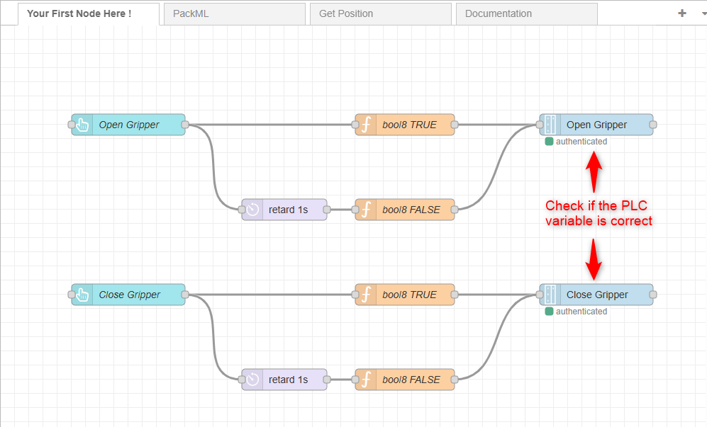
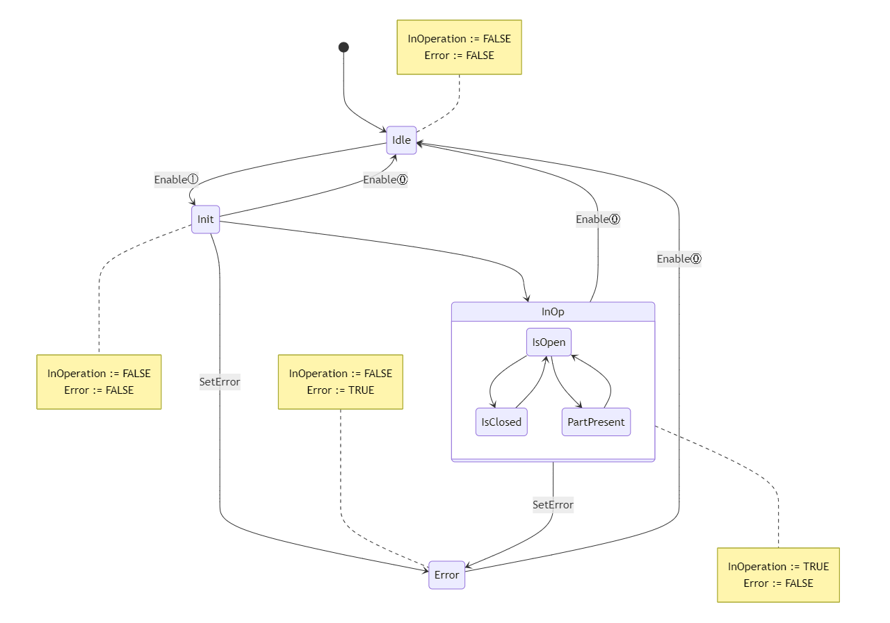

<h1 align="left">
  <br>
  
  <br>
  HEI-Vs Engineering School - Industrial Automation Base
  <br>
</h1>

Cours AutB

Author: [Cédric Lenoir](mailto:cedric.lenoir@hevs.ch)
> Version 2025, V1.0

# LAB 04 Programmierung eines Funktionsblocks (FB), der einen Aktuator steuert.

In dieser Arbeit werden wir :
1. Zwei Funktionsblöcke (FB) basierend auf dem **Execute**-Modell programmieren, um das Öffnen und Schließen eines Greifers zu steuern.
2. Einen Funktionsblock (FB) basierend auf dem Modell **In Operation Base** programmieren, um den Status eines Greifers zu erfahren.


<br>

<u>Zur Erinnerung </u> : 

- Das Modell **"Execute “** funktioniert nach dem Prinzip einer einmaligen Auslösung.
- Das Modell **"In Operation Base “** arbeitet nach dem Prinzip der kontinuierlichen Auslösung.
  
<br>


# Beschreibung der Zange
Die Zange, die wir im Rahmen dieser praktischen Arbeit verwenden werden, wird von der Firma Schunk hergestellt.
Sie wird beim Öffnen und Schließen mit einem monostabilen 5/2-Magnetventil gesteuert.

<u>Bestellnummer der Zange </u>: MPG + 40 (305521)

<figure>
    
    <figcaption>Schunk MPG + 40</figcaption>
</figure>


## Technische Daten

|Eigenschaft |Merkmal|
|-----------------------------------|-------------|
| Hub pro Finger| 6 mm|
|Kraft beim Schließen| 135 N|
|Kraft beim Öffnen| 110 N|
| Maximale Umgebungstemperatur | 90 °C|


<br>

# Beschreibung des Sensors der Zange.
Die Zange ist mit einem Öffnungssensor ausgestattet, der von der Firma Schunk entwickelt wurde.
Dieser Sensor nutzt die Hall-Effekt-Technologie, um die Öffnung der Zange genau zu messen.

<u>Sensorreferenz </u>: MMS 22-IO link (0315830)


<figure>
    
    <figcaption>Schunk MMS 22-IO-Link</figcaption>
</figure>

<br>

Dieser Sensor basiert auf der Punkt-zu-Punkt-Kommunikationsschnittstelle **IO-Link** (entspricht der Norm IEC 61131-9).

Im Gegensatz zu herkömmlichen Systemen, bei denen die Analog-Digital-Wandlung auf der analogen Eingangskarte der SPS stattfindet, wird sie hier direkt im Sensor vorgenommen.


Die einzigen **synchronen Daten** (Prozessdaten), die von diesem Sensor übertragen werden, ist die gemessene Entfernung.

## Technische Daten

| Eigenschaft | Merkmal|
|--------------|-------------|
|Description| Current process value|
|Data type| UIntegerT|
|Bit length| 16-bit|
|Bit offset| 0|
|Value range| 0 – 10000 (depending on the entered value for stroke per jaw)|
|Factor| 0.01|
|Offset| -|
|Unit| mm|


<br>

<u>Konfiguration des im Automatisierungslabor verwendeten Sensors </u> :

| Beschreibung | Von Sensor übertragener Wert|
|------------|-------------|
| Geschlossene Klemme | 1000|
|Klemme offen | 0|


<br>


# Zu erledigende Arbeit

## Bestellung der Zange

<u>Ziel </u>:

Programmieren Sie zwei Funktionsblöcke (FB), die auf dem **Execute**-Modell basieren und das Öffnen und Schließen der Zange steuern, unter Einhaltung des folgenden Zustandsdiagramms: 


<figure>
    
    <figcaption>Zustandsdiagramm „Execute“ </figcaption>
</figure>


<br>

***Voraussetzung:***
Um die Zangenverwaltung zu deaktivieren, die bereits in dem zur Verfügung gestellten Programm implementiert ist, löschen Sie ``PRG_DeviceManager`` unter Task Configuration --> MainTask (IEC-Tasks).

<figure>
    
    <figcaption>PRG_DeviceManager deaktivieren</figcaption>
</figure>


<br>

<u> Vorgehensweise </u>:
1.  Programmieren Sie den DUT (Data User Type) ``E_ExecuteGripper`` vom Typ ENUM (Aufzählung), der die verschiedenen möglichen Zustände des Greifers enthält.

<br>

2.  Programmieren Sie die FBs (Function Blocks) ``FB_OpenGripper`` und ``FB_CloseGripper`` anhand des untenstehenden Schnittstellenbeispiels.
   
<br>
   
<u> Schnittstelle des FB ``FB_OpenGripper`` </u> :

``` iec 61131-3

FUNCTION_BLOCK FB_OpenGripper

VAR_INPUT
	Execute: BOOL;
	thOpenMax: WORD := 50; // Threshold to reach for gripper open
END_VAR

VAR_IN_OUT
	hwSensor: UA_Schunk_mms;
	hwEV: UA_Festo;
END_VAR

VAR_OUTPUT
	Done: BOOL;
	Active: BOOL;
	Error: BOOL;
END_VAR

VAR
	tnCheckDone: TON; // Time for opening before error
	rExecute: R_TRIG;
	eExecuteGripper: E_ExecuteGripper;
END_VAR

```

<br>


**Hinweis:**
Der Greifer wird über ein **monostabiles** Magnetventil geöffnet oder geschlossen.
Daher muss ihr Befehl auf ``TRUE`` (oder ``FALSE``) bleiben, nachdem der entsprechende FB ausgeführt wurde.


<u>Beispiel für den FB ``FB_OpenGripper`` </u>:

```iecst

IF eExecuteGripper = E_ExecuteGripper.InOp THEN
	hwEV.SetOut := TRUE;
END_IF

```


<br>


Vergessen Sie nicht, die Funktionsblöcke ``FB_OpenGripper`` und ``FB_CloseGripper`` aus dem Hauptprogramm ``PRG_Student`` aufzurufen!


```iecst
fbOpenGripper(hwEV := GVL_Abox.uaAboxInterface.uaSchunkGripper,
	  hwSensor := GVL_Abox.uaAboxInterface.uaSchunk,
	       Done => stTestFbGripperHmi.executeOpenDone);
			  
fbCloseGripper(hwEV := GVL_Abox.uaAboxInterface.uaSchunkGripper,
	   hwSensor := GVL_Abox.uaAboxInterface.uaSchunk,
	        Done => stTestFbGripperHmi.executeCloseDone);
```


<br>

3. Testen Sie die Funktionsfähigkeit der Funktionsblöcke (FB).

Die Überprüfung der Funktionstüchtigkeit der FBs kann entweder mit dem Tool „Watch“ oder über Node-RED mit einem zur Verfügung gestellten Programm durchgeführt werden.


<u>Information </u>:
Sie können einen DUT (Data User Type) vom Typ STRUCT erstellen, der Ihnen beim Schreiben auf den Eingangsparameter ``Execute`` der FBs hilft.

Deklaration der Struktur :
```iecst
TYPE ST_TestFbGripperHmi :
STRUCT
	openGripper			: BOOL;
	closeGripper			: BOOL;
END_STRUCT
END_TYPE
```

<br>
Verwendung der strukturierten Variable im Programm :

```iecst
// Request to open / close gripper
fbOpenGripper.Execute := stTestFbGripperHmi.openGripper;
fbCloseGripper.Execute := stTestFbGripperHmi.closeGripper;
```


<br>

<u> Vorgehensweise bei der Nutzung der zur Verfügung gestellten Anwendung „Node-RED“ </u> :


1. Ersetzen Sie die Datei ``flows.json``, die sich im Verzeichnis C:`Users\[ton_name_user]`.node-red befindet, durch die Datei ``flows.json``, die sich unter: autb-lab-04_2025\PracticalWork_04_Student befindet.

<br>

2. Starten Sie Node-RED.  
- Öffnen Sie die Eingabeaufforderung (--> cmd.exe).
- Geben Sie den Befehl ein: node-red

<br>

3. Rufen Sie die Benutzeroberfläche von Node-RED auf.  
- Öffnen Sie den Browser.
- Geben Sie die URL ein: http://localhost:1880

<br>

4) Installieren Sie zusätzliche Module für die Anwendung (falls nötig!).

- Klicken Sie auf die drei horizontalen Striche in der oberen rechten Ecke.
<figure>
	 
</figure>

--> Gérer la palette  

--> Sélectionner l'onglet "Installer" 

--> Installieren Sie die folgenden Module : 

	- @flowfuse/node-red-dashboard
	- node-red-contrib-ctrlx-automation

<br>

5) Dashboard öffnen


<figure>
	
	<figcaption>Dashboard öffnen/figcaption>
</figure>


<br>

<u> Ergebnis </u> :


Dashboard :
<figure>
    
    <figcaption>Dashboard de Node-RED</figcaption>
</figure>

<br>
Code :
<figure>
    
    <figcaption>Testprogramm in Node-RED</figcaption>
</figure>


<br>

6. Drücken Sie die Tasten ``Open`` und ``Close`` auf dem Dashboard „Node-RED“, um die korrekte Funktion der Funktionsblöcke ``FB_OpenGripper`` und ``FB_CloseGripper`` zu bestätigen.


<br>


<br>


## Staaten der Klammer

<u>Ziel </u>:

Programmieren Sie einen Funktionsblock (FB) auf der Grundlage des Modells **In Operation Base**, der den Zustand des Greifers gemäß dem folgenden Zustandsdiagramm ermittelt: 


<figure>
    
    <figcaption>In Operation Base mit Unterstaaten</figcaption>
</figure>


<br>

<u> Vorgehensweise </u>:
1.  Programmieren Sie die DUTs (Data User Type) ``E_InOperationBaseGripper`` und ``E_InOpGripper`` vom Typ ENUM (Aufzählung), die die verschiedenen möglichen Zustände des Greifers enthalten.
<u>Hinweis</u>: Fügen Sie den Unterzustand ``isIdle`` (nicht auf der obigen Zustandsmaschine dargestellt) in das DUT ``E_InOpGripper`` ein.

<br>

3.  Programmiere den FB (Function Block) ``FB_GripperState`` anhand der unten abgebildeten Schnittstelle.


``` iec61131-3

FUNCTION_BLOCK FB_GripperState

VAR_INPUT
	/// Default Input 
	Enable: BOOL;
	/// User Defined Inputs 
	thOpen: WORD := 50;     // Threshold gripper open
	thClose: WORD := 950;   // Threshold gripper closed
	thPartMin: WORD := 800; // Threshold minimum part present
	thPartMax: WORD := 860; // Threshold maximum part present
END_VAR

VAR_IN_OUT
	hw: UA_Schunk_mms;
END_VAR

VAR_OUTPUT
	/// Default Outputs 
	InOperation: BOOL;
	Error: BOOL;
	/// User Outputs 
	IsOpen: BOOL;      // Clipper opened
	IsClosed: BOOL;    // Clipper closed
	PartPresent: BOOL; // Part present
END_VAR

VAR
	eInOperationBaseGripper: E_InOperationBaseGripper := E_InOperationBaseGripper.Idle;
	eInOpGripper: E_InOpGripper := E_InOpGripper.IsIdle;
	tonIdleCondition: TON;
END_VAR
```


<br>

**Bemerkungen :**

- Der Zustand des Greifers muss im ``Init``-Zustand bestimmt werden, bevor er in den ``InOp``-Zustand der internen Maschine übergeht.
- Um zu vermeiden, dass ein Fehler erzeugt wird, wenn sich der Greifer bewegt, kann die Zeitverzögerung ``tonIdleCondition`` verwendet werden, um dem Greifer Zeit zu geben, seine Endposition zu erreichen.
- Die Ausgänge **IsOpen**, **IsClosed** und **PartPresent** werden nur aktiviert, wenn sich die Hauptzustandsmaschine im Zustand ``InOp`` befindet.
- Der Zustand ``IsIle`` wird der internen Zustandsmaschine hinzugefügt, allerdings wird er nicht aktiviert, da die interne Zustandsmaschine in ``Init`` mit den Zuständen entweder ``IsOpen``, ``IsClosed`` oder ``PartPresent`` initialisiert ist.
- Der Zustand ``IsIdle`` in InOp führt zu einem **Fehler**.
  
Es ist möglich, dass der Zustand der Zange unbestimmt ist, z. B. wenn der Luftdruck fehlt. In diesem Fall muss das Fehlersignal aktiviert werden.

<br>

Vergessen Sie nicht, den Funktionsbaustein ``FB_GripperState`` aus dem Hauptprogramm ``PRG_Student`` aufzurufen !

```iecst
fbGripperState(Enable := TRUE,
	           hw := GVL_Abox.uaAboxInterface.uaSchunk);
```


<br>

3. Testen Sie die Funktion des Funktionsblocks (FB).

Die Überprüfung der Funktionsweise des FB kann über ein „Dashboard“ erfolgen, das mit Node-RED implementiert wurde.

<u>Information </u>:
Sie können den in der vorherigen Übung erstellten DUT (Data User Type) vom Typ STRUCT ergänzen, um Ihnen beim Lesen der Ausgabeparameter des FBs zu helfen.

Deklaration der Struktur :
```iecst
TYPE ST_TestFbGripperHmi :
STRUCT
	openGripper			: BOOL;
	closeGripper			: BOOL;
	gripperStateClosed		: BOOL;
	gripperStateOpen		: BOOL;
	gripperStatePartPresent	   	: BOOL;
	gripperStateError		: BOOL;
	gripperStateInOp		: BOOL;
END_STRUCT
END_TYPE
```

<br>
Verwendung der strukturierten Variable im Programm :
```iecst
stTestFbGripperHmi.gripperStateClosed := ...
stTestFbGripperHmi.gripperStateOpen := ...
stTestFbGripperHmi.gripperStatePartPresent := ...
stTestFbGripperHmi.gripperStateError := ...
stTestFbGripperHmi.gripperStateInOp := ...
```


<br>

<u> Vorgehensweise bei der Nutzung der zur Verfügung gestellten Anwendung „Node-RED“ </u> :
1. Führen Sie die Schritte aus der vorherigen Übung „Bedienung der Zange“ (Punkt 1 bis 5) durch.
2. Schalten Sie die Anlage mithilfe des Bedienfelds „Siemens“ ein.
   
- Mit der Schaltfläche ``Manual`` den Modus „Manual“ auswählen.
- Setzen Sie die Anlage mit den Schaltflächen ``Reset`` und ``Start`` in den Zustand „Execute“.

<figure>
	
	<figcaption>HMI auf „Siemens“-Bedienpanel</figcaption>
</figure>


<br>

3. Bewegen Sie den Greifer mithilfe des Dashboards „Node-RED“ und drücken Sie die Tasten ``Open`` und ``Close``, um die korrekte Funktion des Funktionsblocks ``FB_GripperState`` zu bestätigen.


<figure>
    
    <figcaption>Sensor-/Zangentest mit Reagenzglas</figcaption>
</figure>


# Schlussfolgerung
Die Funktionsblockmodelle „Execute“ und „In Operation Base“ spielen eine Schlüsselrolle bei der Programmierung von SPSen gemäß IEC 61131-3.

Zusammenfassend lässt sich sagen, dass das Modell „Execute“ sich auf die einmalige Ausführung bestimmter Aufgaben konzentriert, während das Modell „In Operation Base“ Aufgaben kontinuierlich verwaltet.

