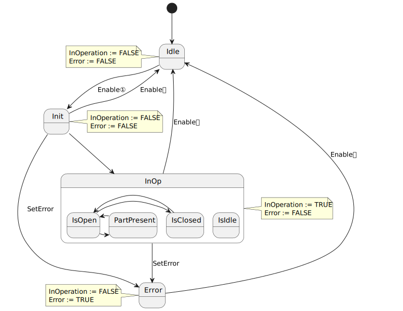

<h1 align="left">
  <br>
  
  <br>
  HEI-Vs Engineering School - Industrial Automation Base
  <br>
</h1>

Cours AutB

Author: [Cédric Lenoir](mailto:cedric.lenoir@hevs.ch)

# LAB 04 A function block for an actuator

In dieser Arbeit werden wir zwei FBs vom Typ **Execute**, **Open** und **Close** erstellen, um einen Greifer zu steuern, einen Sensor zu *greifen* und zu überwachen, indem wir einen FB vom Typ **Enable** verwenden. .

# Sensor
Im Rahmen dieser praktischen Arbeit verwenden wir einen Original-Hall-Effekt-Sensor von Schunk.

<figure>
    
    <figcaption>Schunk MMS 22-IO-Link</figcaption>
</figure>

> Dieser Sensor nutzt die **IO-Link**-Technologie. Es dient zur Bestimmung der Öffnungsposition eines pneumatischen Stellantriebs.

> Was uns im Hinblick auf die SPS-Programmierung interessiert, ist das bereitgestellte Datenformat, Typ ``WORD``.

# Gripper

<figure>
    
    <figcaption>Schunk MGM-plus 40</figcaption>
</figure>

> Beachten Sie die beiden Schrauben oberhalb des Schunk-Logos, die zur Befestigung des Sensors dienen.

## Technische Daten
MPG-plus Kleinteilegreifer, Größe: 40, pneumatisch

|Titel |Werte|
|----------|------------- |
|Fingerstrich| 6mm|
|Zum Schließen erzwingen| 135 N|
|Öffnungskraft| 110 N|
|Maximale Umgebungstemperatur. | 90°C |

> Diese technischen Daten betreffen hauptsächlich die Person, die die Hardware verwaltet.

Mit einem empirischen Programmiersystem könnten wir sagen, dass alles, was wir für einen Sensor benötigen, ein analoger oder digitaler Eingang ist, also letztendlich ein ``REAL`` oder ein ``BOOL``.

In der Praxis wird eine einfache Eingabe oder Ausgabe von einer Logik umgeben sein, die es ermöglicht, sie zu formatieren und zu validieren. Um zu vermeiden, dass für jeden Eingang und jeden Ausgang dieselbe Logik neu geschrieben wird, werden wir alles in einem Block kapseln. Der Funktionsblock.

# Zielsetzung
- Einen Funktionsblock vom Typ Execute verstehen und schreiben.
- Einen Funktionsblock vom Typ ``Enable`` verstehen und schreiben.

> Wir können mit dem einen oder anderen der FBs beginnen. Der Typ **Execute** [ist in diesem Job wahrscheinlich zunächst etwas einfacher](#typ-execute).

#HMI
Verwenden Sie die einfache HMI, um einige Werte anzuzeigen.

# Typ Enable
Wir verwenden den Typ ``Enable``, um festzustellen, ob der Greifer offen oder geschlossen ist.

## State Machine
<figure>
    
    <figcaption>Enable In Operation Base</figcaption>
</figure>

## Your Job
Use the folder Your Job in the project of the BaseInterfaceUA to create your ENUM, FB.

### FB-Name:
**FB_GripperState**
Als Hardware-I/O den Typ **UA_Schunk_mms** verwenden.

> Erwägen Sie die Erstellung des FB in strukturiertem Text.

Verwenden Sie vier Schwellenwerte, *Schwellenwert* in **Eingabe** mit einem Typ, der dem der Hardware entspricht:
-   thOpen
-   thClosed
-   thPartMin
-   thPartMax

um abhängig von der Position des Sensors eines der folgenden drei **Ausgangssignale** zu ermitteln:

-   isOpen
-   isClosed
-   PartPresent

In diesem Fall integrieren wir eine Zwischenzustandsmaschine in den **InOp**-Zustand des FB Enable. Bitte beachten Sie, dass es möglich ist, dass der Zustand unbestimmt ist, z. B. wenn der Luftdruck fehlt. In diesem Fall muss das Fehlersignal aktiviert werden.

– Verwenden Sie **E_InOperationBase** für die Basis-Enumeration.
- Verwenden Sie **E_InOpGripper** für die für diesen FB spezifische Aufzählung.
- Initialisieren Sie Ihre interne Zustandsmaschine im Leerlauf.
- Überprüfen Sie den Zustand des Greifers in Init und ermitteln Sie den Grundzustand der internen Maschine von InOp, bevor Sie in diesen Zustand gelangen.
- Vergessen Sie nicht die beiden Grundausgänge des FBs vom Typ ``Enable``.
- Die Ausgänge **IsOpen**, **IsClosed** und **PartPresent** können nur aktiv sein, wenn sich die Hauptzustandsmaschine im Status **InOp** befindet.

> Beachten Sie, dass es für den Zustand **IsIdle** keinen Übergang gibt, da die interne Zustandsmaschine in Init initialisiert wird.
> Der Zustand **IsIdle** in InOp führt zu einem **Error**.

<figure>
    
    <figcaption>Enable In Operation Base with sub-states</figcaption>
</figure>

## Vor der Verarbeitung der Zustandsmaschine ``E_InOperationBase``.
Wir müssen bedenken, dass wir während der Bewegung des Greifers keinen Fehler erzeugen dürfen. Verwechseln Sie einen Übergangszustand nicht mit dem Fall, dass keine Luftzufuhr vorhanden ist.

Als Eingabebedingung verwenden wir einen Timer, um basierend auf den Schwellenwerten, th*** und dem Sensorsignal ein Signal ``tonIdleCondition.Q`` zu generieren.

Sobald die Übergangszonen mithilfe des Timers verarbeitet werden, ist eine Verarbeitung dieser Zonen im restlichen Code nicht mehr erforderlich.

## Du testest diese FB.
Um die Ausgänge Ihres FBs mit dem HMI zu verknüpfen, können Sie folgende Variablen nutzen:
```iecst
stTestFbGripperHmi.gripperStateClosed := ...
stTestFbGripperHmi.gripperStateOpen := ...
stTestFbGripperHmi.gripperStatePartPresent := ...
stTestFbGripperHmi.gripperStateError := ...
stTestFbGripperHmi.gripperStateInOp := ...
```

## Integrieren Sie den FB mit folgendem Code:

```iecst
(**************************************************************************
    YOUR CODE HERE
**************************************************************************)
fbGripperState.Enable := (stPlcOpenFbs.bEnableRemote)        		OR
                   		 (NOT stPlcOpenFbs.bEnableRemote 		AND 
				   		  NOT (fbPackStates.state.Aborting OR
                               fbPackStates.state.Aborted)); 
fbGripperState(hw := GVL_Abox.uaAboxInterface.uaSchunk);

```

Das heißt, wenn z.B. die Tür geöffnet wird, wird der Maschinenstatus **Abgebrochen** sein und dadurch wird der FB deaktiviert, um z.B. den Fehler zu beheben. Dann genügt ein **Reset**, um in den Zustand **Gestoppt** zu gelangen und der FB wird wieder aktiviert.


# Typ Execute
Wir werden zwei FBs vom Typ Execute erstellen, um den Greifer zu steuern.
**FB_OpenGripper** et **FB_CloseGripper**.

## Rappel
<figure>
    
    <figcaption>Execute Done Base</figcaption>
</figure>

## Your job !

Verwenden Sie für jeden FB in I/O:
-	```hwSensor := UA_Schunk_mms;```
-	```hwEV := UA_Festo;```

Verwenden Sie einen Eingabeparameter
``thClosedMin``, für den **thClosedMin**, den der Sensor erreichen muss, damit der Greifer im **FB_CloseGripper** als geschlossen gilt.
``thOpenMax``, für den **thOpenMax** Wert, den der Sensor erreichen muss, damit der Greifer in **FB_OpenGripper** als geöffnet gilt.

Die anderen Ein- und Ausgänge sind die grundlegenden für einen FB vom Typ Execute.

Schließlich fügen wir einen Timer von 1[s] hinzu, um die Schließ- oder Öffnungszeit des Greifers zu steuern. Bei Überschreitung des Zeitlimits wird ein Fehler angezeigt.

> Im Vergleich zum im Kurs vorgestellten Grundmodell berücksichtigen wir nicht die Ausführung bei steigender Flanke an Init und InOp. Andererseits **halten wir den Trigger auf der steigenden Flanke, um von Idle auf Init zu wechseln**.

> Vergessen Sie nicht, das Magnetventil zu aktivieren oder nicht.

> Vor allem keine kombinatorische Logik zur Ansteuerung des Magnetventils verwenden!

Das heißt:
```iecst
	hwEV.SetOut := (eExecuteDone = E_ExecuteDone.InOp); // Do not do like that !!!

	// Do like that:
	IF eExecuteDone = E_ExecuteDone.InOp THEN
		hwEV.SetOut := TRUE;		// Or FALSE
	END_IF
```
Der Grund ist folgender: Wenn kombinatorische Logik verwendet wird, kann ein anderer FB hwEV.SetOut nicht mehr ändern, solange der FB aktiv ist. Der Zweck eines Execute-Typs besteht darin, eine Aktion einmalig zu aktivieren oder zu steuern.

> Andererseits können wir auch sehen, dass dieser FB, wie andere FBs auch, in einem unbestimmten internen Zustand bleibt, wenn er nicht kontinuierlich aufgerufen wird, er könnte beispielsweise nicht im Zustand E_ExecuteDone.InOp bleiben, was würde alle neuen Execute-Befehle verhindern. Deshalb ist es wichtig, einmal einen richtig strukturierten FB zu schreiben.

## Testen Sie die FB
Beispielsweise können wir den FB über die folgenden Variablen mit dem HMI verknüpfen: ``stTestFbGripperHmi.executeOpenDone`` und ``stTestFbGripperHmi.executeCloseDone``.

```iecst
fbOpenGripper(hwEV := GVL_Abox.uaAboxInterface.uaSchunkGripper,
	          hwSensor := GVL_Abox.uaAboxInterface.uaSchunk,
			  Done => stTestFbGripperHmi.executeOpenDone);

fbCloseGripper(hwEV := GVL_Abox.uaAboxInterface.uaSchunkGripper,
	          hwSensor := GVL_Abox.uaAboxInterface.uaSchunk,
			  Done => stTestFbGripperHmi.executeCloseDone);
```

## Sobald alles funktioniert
Abhängig von der Zustandsmaschine, die die X-Achse steuert, können wir zunächst den Greifer aktivieren.

```iecst
fbOpenGripper.Execute := (stStateMachineInfo.eState = E_Execute.eMotionBackDone) OR 
                         (eStarting = E_Starting.eMotionStartingDone);

fbCloseGripper.Execute := (stStateMachineInfo.eState = E_Execute.eMotionFwdDone);
```

Abschließend können wir noch den folgenden Code hinzufügen, um zu verhindern, dass sich die Achsen bewegen, bis der Greifer eine Bewegung abgeschlossen hat.

```iecst
GripperIsOpen   := fbOpenGripper.Done;
GripperIsClosed	:= fbCloseGripper.Done
```

# Quelques liens
[IO-Link, site officiel](https://io-link.com)

[IODDfinder](https://ioddfinder.io-link.com)

