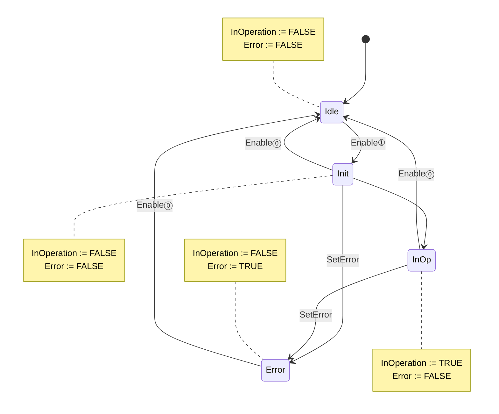

```mermaid
stateDiagram
    [*] --> Idle

    Idle --> Init : Enable①

    Init --> Idle : Enable⓪
    Init --> Error : SetError
    Init --> InOp

    InOp --> Idle : Enable⓪
    InOp --> Error : SetError

    Error --> Idle : Enable⓪


    note left of Idle
        InOperation := FALSE
        Error := FALSE
    end note

    note right of Init
        InOperation := FALSE
        Error := FALSE
    end note

    note right of InOp
        InOperation := TRUE
        Error := FALSE
    end note

    note left of Error
        InOperation := FALSE
        Error := TRUE
    end note
```