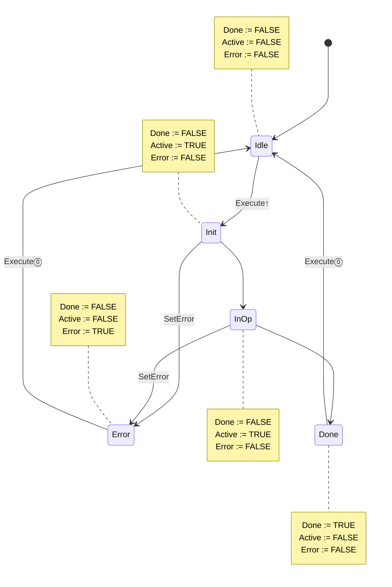

```mermaid
stateDiagram-v2

    [*] --> Idle
    
    Idle --> Init : Execute↑

    Init --> Error : SetError
    Init --> InOp

    InOp --> Done 
    InOp --> Error : SetError

    Error --> Idle : Execute⓪

    Done --> Idle : Execute⓪


    note left of Idle
        Done := FALSE
        Active := FALSE
        Error := FALSE
    end note

    note left of Init
        Done := FALSE
        Active := TRUE
        Error := FALSE
    end note

    note right of InOp
        Done := FALSE
        Active := TRUE
        Error := FALSE
    end note

    note left of Error
        Done := FALSE
        Active := FALSE
        Error := TRUE
    end note

    note right of Done
        Done := TRUE
        Active := FALSE
        Error := FALSE
    end note

```